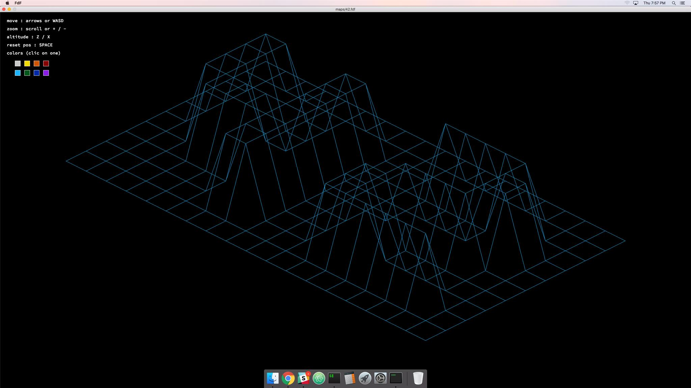
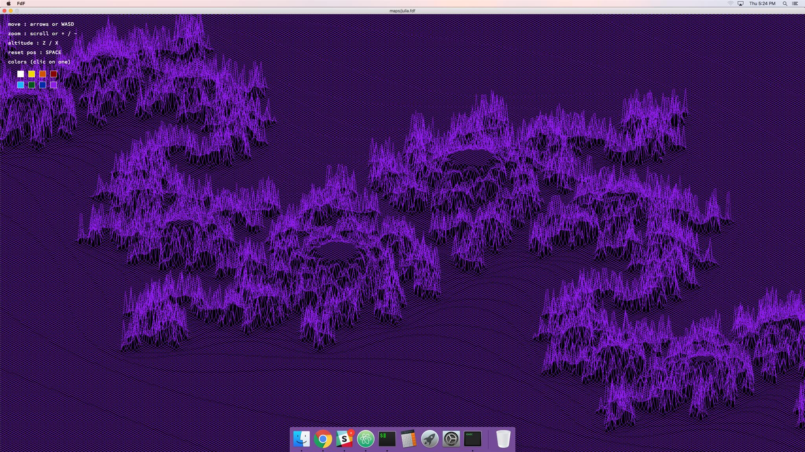
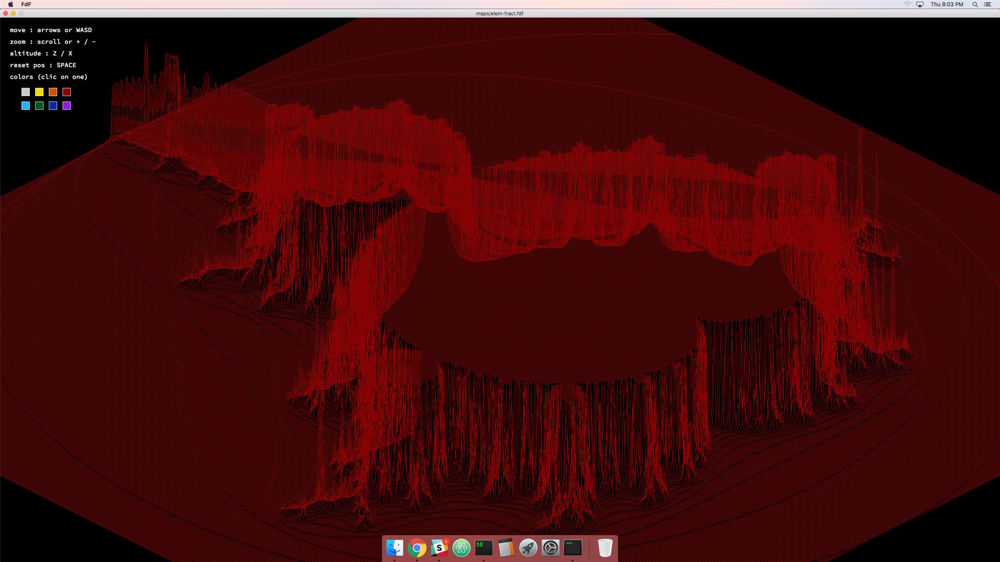
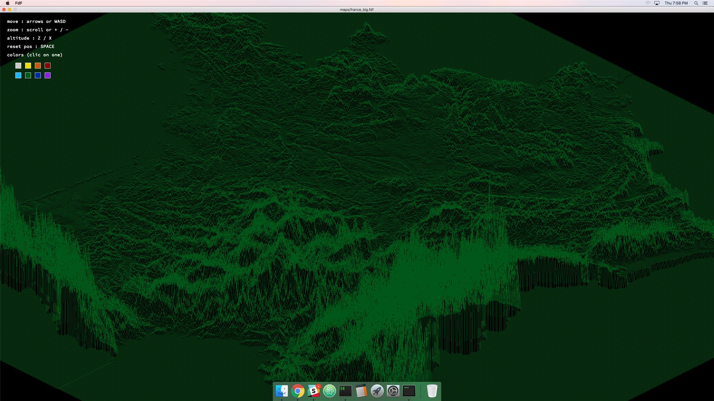

# 
## FdF (stands for "Fils de Fer", translated "Wireframes")
The objective of the project was to render wireframe representations of landforms. It was an individual school project, made from scratch and entirely in C.

## Installing
#### Mac only portability.
Simply run
```
$ make
```

## Usage
### Running the programm
The programm takes a map as an argument :
```
$ ./fdf 'file_name'
```
Different **maps** are available in the directory with the same name

### Hotkeys
#### Moving
- **` W A S D `** or ` 🠙 🠘 🠛 🠚 `
#### Zooming
- **` + `** & **` - `** or **` Mouse wheel `**
#### Colors
- **`left clic`** on color squares
#### Altitude
- **` Z `** to increase altitude
- **` X `** to decrease altitude
#### Reset
- **` SPACE `** to reset everything

## Screenshots
# 
# 
# 
